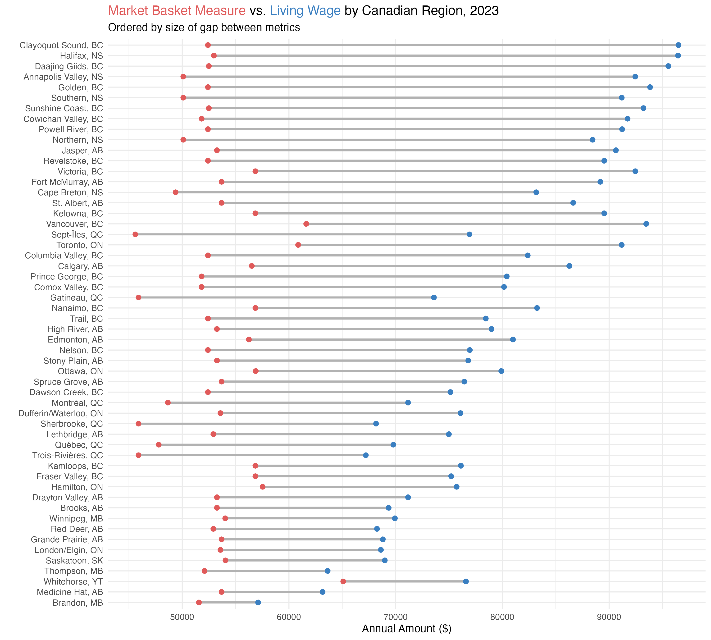
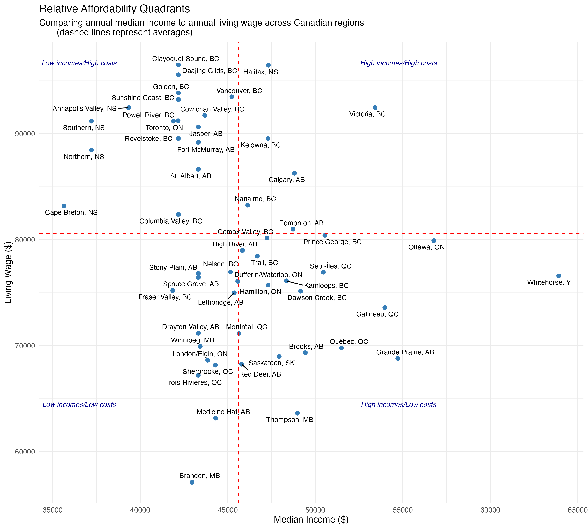
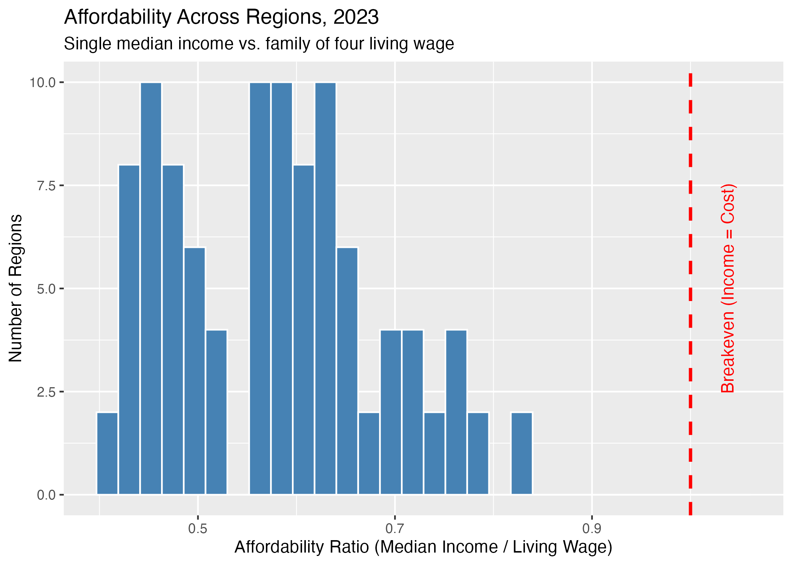
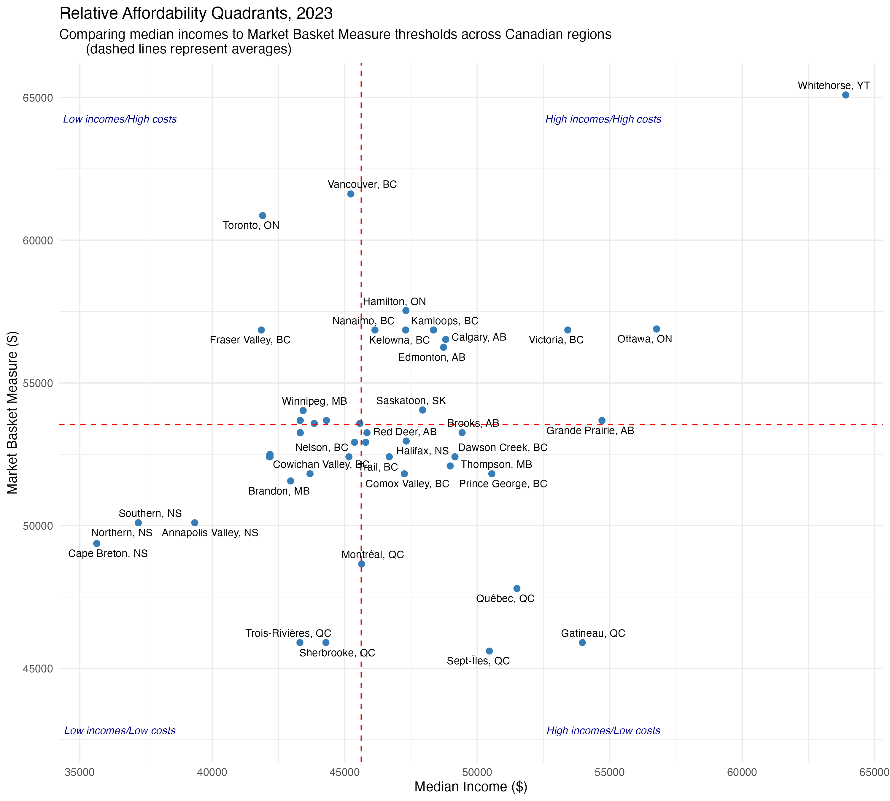
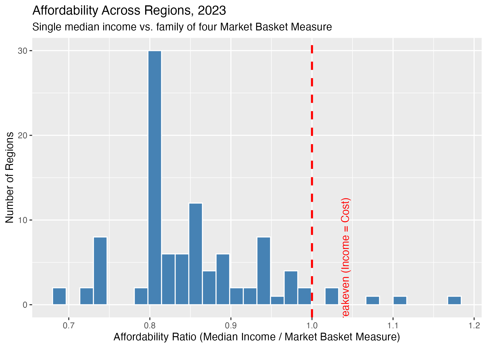
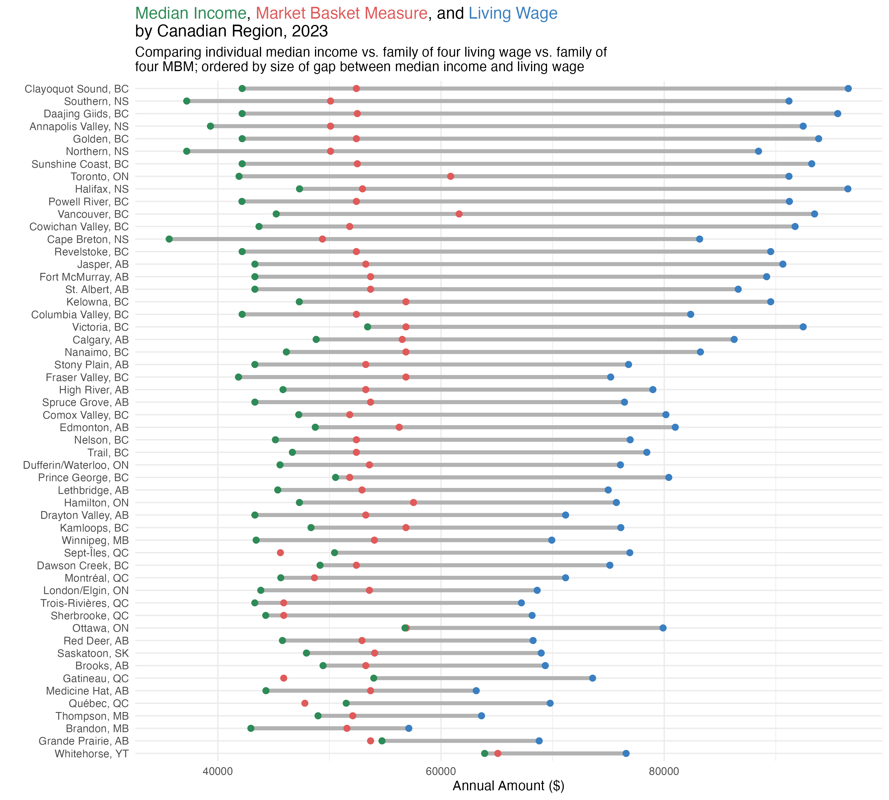
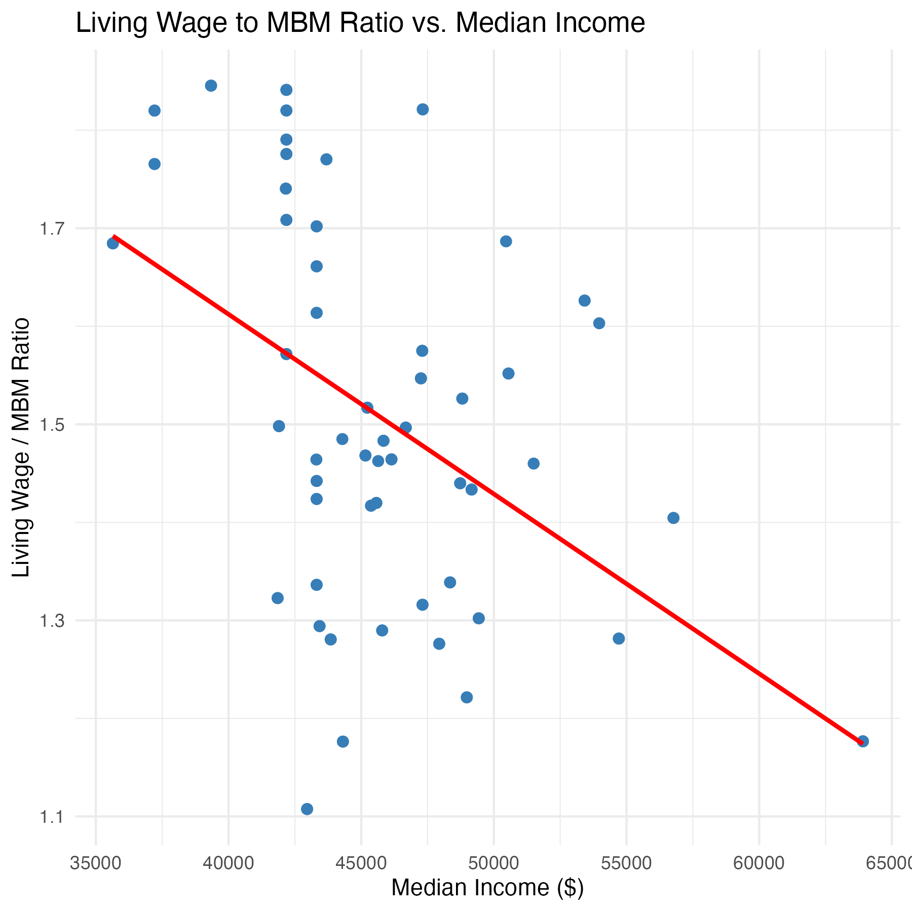

**Introduction**

Grievances over rising costs of living and declining purchasing power have been prominent in Canadian public discourse since at least the COVID-19 pandemic (Government of Canada, 2024). Data backs up these sentiments; groceries and rent prices in Canada have been growing faster than wages for years (Lam, 2024). Canada's purchasing power parity-adjusted GDP per capita ranked 31st globally in 2024 ("GDP per capita, PPP (current international \$)"). Given the cost of living's dominant presence in Canadians' personal and political lives, exploring affordability metrics across the country is highly relevant.

This project investigates two measures of regional costs of living and their relationship to regional median incomes, aiming to uncover patterns in affordability across Canada and to reveal whether local incomes tend to be proportionate with local costs of living.

The first metric is the Market Basket Measure, the Government of Canada's official poverty threshold, calculated annually by Statistics Canada for 53 geographic areas. It represents the finances needed for a family of two adults and two children to afford a basic, standardized set of goods and services (food, housing, clothing, transportation, etc.) for one year based on local costs.

The second metric is the regional living wage, calculated by advocacy organizations across Canada. It represents the hourly wage needed for two adults to support a family of four to fully participate in their community. For this project, the living wage is converted to an annual figure to allow more direct comparison with the Market Basket Measure. Annual living wage figures tend to be higher than the Market Basket Measure, reflecting a more sustainable standard of living for a family.

Regional median incomes are drawn from Statistics Canada's 2023 income survey, allowing for investigation into real incomes versus calculated costs of living to highlight affordability gaps and trends.

With this context in place, the project aims to answer the following research question: How do cost of living metrics vary across Canadian regions, and how does this variation relate to differences in median incomes?

**Data Sourcing and Preparation**

Living wage figures were sourced from four websites. Livingwage.ca gathers and shares calculations from across the country, and their summary table of rates was scraped. Several Canadian regions were notably absent from this table, so rates for Quebec and Yukon were added separately after manually researching available living wage calculations for those areas.

The livingwage.ca website contained a datawrapper table with a summary of living wage rates across many Canadian regions. Scraping the table directly was unfruitful, as the datawrapper table appeared to block scraping attempts. Following the link at the bottom of the table led to a simpler datawrapper page containing only the table in CSV format, which allowed for direct loading in R.

The Quebec living wage rates were found at https://iris-recherche.qc.ca/publications/revenu-viable-2023/. Several attempts to scrape the rates directly from the HTML article or the linked PDF did not work out, as the website appeared to have stricter anti-scraping settings. The relevant table was again a datawrapper table, but the approach used for livingwage.ca did not work here. The CSV was therefore downloaded manually from a link at the bottom of the table.

A living wage figure for the Yukon was found at https://yapc.ca/assets/documents/Living_Wage_in_Whitehorse_2023\_-\_Infographic.pdf and scraped from the PDF by extracting a specified string structure.

Market Basket Measure thresholds and regional median incomes were sourced from the Statistics Canada API using the cansim R package, which only required the ID numbers of the relevant tables.

To prepare the data for analysis, the Yukon, Quebec, and national living wage files were combined into a single data frame after standardizing variable names and filtering out unneeded figures. The preprocessed living wage data contains 2023 annual figures for all identified regions across Canada. The median income and Market Basket Measure data frames were similarly filtered down to clean regional tables for 2023.

Region names were not standardized across the various data sources, so a significant part of data preparation involved harmonizing them to facilitate joining. This was handled through a manual lookup script (city_name_mapping.R) that matches region names across sources. Regions without values for all three variables (living wage, Market Basket Measure, and median income) were dropped from the combined data frame.

**Bivariate Analysis**

The analysis began by examining each pairing of the three variables separately. A dumbbell plot comparing the living wage to the Market Basket Measure shows that the living wage is higher than the MBM across all studied regions, though the size of this difference varies considerably, from \$5,545.60 in Brandon, Manitoba to \$44,084.40 in Clayoquot Sound, British Columbia.

The living wage was then compared to the median income. Since the living wage reflects the cost of living for a family of four while the median income reflects individual earnings, they are not directly comparable in absolute terms, but investigating trends in their relationship is still worthwhile. A scatter plot with quadrant analysis was created to identify regions with potentially higher or lower cost of living stress, with quadrant dividers drawn at the mean value of each variable. The plot reveals that low median incomes and high living wages is the most frequent quadrant, suggesting prevalent cost of living difficulties.

A Spearman's correlation test between median incomes and living wages returns -0.36 with a p-value under 0.0002, a weak to moderate correlation indicating that as median incomes increase in the dataset, living wages have a slight tendency to decrease. This is a somewhat counterintuitive finding, suggesting that lower cost of living areas may have somewhat higher median incomes.

Dividing the median income by the living wage produces an affordability ratio that reveals whether a single median earner can afford to support a family of four at the living wage standard of living. A histogram of this ratio shows that none of the regions in the dataset have a median income high enough to do so. The average affordability ratio is 0.577, meaning the median earner can on average afford 57.7% of a family of four's living wage cost of living. Comparing 2x the median income to the living wage, to represent a theoretical dual income household, yields an average affordability ratio of 1.15, with 31% of regions falling below 1.0. This means that in 31% of studied regions, two median earners together cannot afford a family of four cost of living according to the living wage.

The Market Basket Measure was then compared to the median income using the same approaches. In contrast to the living wage analysis, the scatter plot shows that the lower left quadrant (low median incomes and low cost of living) is the most frequent, which makes sense given that MBM values are all lower than living wages. The upper left quadrant is much less prevalent in this plot, pointing to lower affordability stress overall. This highlights how consequential the choice of metric is when quantifying affordability.

A histogram of the median income/MBM affordability ratio reveals that a few outlier communities have a ratio above 1.0. The average ratio across regions is 0.853, and 95.1% of regions have a ratio below 1.0, meaning a single median earner cannot afford a family of four cost of living at the poverty line in the vast majority of studied regions. The theoretical dual income household, however, can afford the family of four cost of living across all regions in the dataset, with an average dual earner affordability ratio of 1.7.

**Multivariate Analysis**

A dumbbell plot comparing all three variables reveals that the gaps between them vary considerably across regions. To further explore the relationship between the two cost of living metrics and median income, the living wage to MBM ratio was calculated, capturing the gap between a poverty-line standard of living and the higher standard reflected by the living wage. A higher ratio indicates a larger gap, which could mean that costs beyond basic survival are particularly high in a given community, or that advocacy organizations have reached substantially different results from Statistics Canada in their calculations. This ratio has a correlation coefficient of -0.456 with a p-value of 1.477e-06, indicating a statistically significant moderate negative correlation with median income. As median income increases, the relative gap between the living wage and Market Basket Measure tends to decrease, suggesting that lower-income regions may face more significant barriers to reaching a living wage standard of living. Spearman's correlation was used to ensure robust results in the presence of outliers.

**Discussion**

The findings generally align with Canadian public sentiment about affordability difficulties. Based on quadrant analysis, the regions in the dataset appearing to have the highest affordability stress for median earners include the Annapolis Valley, Clayoquot Sound, and Toronto, spanning from the east to the west coast.

The gap between the living wage and the Market Basket Measure varies significantly across regions. It is unclear from the data whether this reflects methodological differences in how living wage calculations are conducted across the country, genuine differences in the cost of living beyond basic survival, or limitations in Statistics Canada's MBM methodology for capturing local costs. Further research would be needed to determine this.

A significant finding is that the median earner cannot afford to support a family of four across nearly all studied regions, even at the poverty line standard of living. This highlights that two incomes are generally required to raise two children, pointing to affordability precarity for families broadly, and extreme precarity for single parents who would need an income well above the median to maintain a healthy standard of living for two children.

The analysis also highlights the importance of scrutinizing metrics before employing them. Using the Market Basket Measure as the cost of living indicator yields very different results than using the living wage. Incorporating multiple metrics, as done here, can help work around the limitations of any single measure, though it introduces additional data challenges.

**Limitations**

This analysis is based on an arbitrary selection of Canadian regions determined by data availability rather than a defined research agenda. While the final sample includes most of Canada's main population centres, the selection of rural areas is fairly haphazard, based on wherever living wage calculations happened to exist. Additionally, some provinces and territories (British Columbia, Quebec, Nova Scotia) are heavily represented while others (New Brunswick, Northwest Territories, Newfoundland, Prince Edward Island, Nunavut) are excluded entirely. The results are therefore not necessarily generalizable to the whole country.

A second geography-related limitation is the lack of geographic precision in some values. The Market Basket Measure reports specific figures for main population centres and then groups the rest of each province or territory into population brackets. This means that imprecise MBM regions were mapped to more precise living wage and median income regions; for example, Brooks, Alberta was linked to "Alberta, population under 30,000." This is a limitation of the source data rather than the analysis itself, but it may weaken results if cost of living varies meaningfully across interprovincial regions within the same population bracket.

A final limitation is the use of median income as the sole income indicator. While this provides a useful snapshot of local economic conditions, it simplifies the income distribution and does not capture income inequality, the depth or prevalence of poverty, or differences across demographic groups such as immigrants, disabled persons, or racialized communities. Bringing in additional data on the income distribution would allow for a richer analysis of how cost of living indicators compare to lived economic realities across Canada.

**LLM Disclosure**

I used Copilot to assist with programming in R and Gemini to help guide statistics and programming approaches and to help interpret statistical findings.

**Sources**

GDP per capita, PPP (current international \$) \[WWW Document\], n.d. . World Bank Open Data. URL <https://data.worldbank.org/indicator/NY.GDP.PCAP.PP.CD?most_recent_value_desc=true> (accessed 4.12.26).

Government of Canada, S.C., 2024. The Daily — Nearly half of Canadians report that rising prices are greatly impacting their ability to meet day-to-day expenses \[WWW Document\]. URL <https://www150.statcan.gc.ca/n1/daily-quotidien/240815/dq240815b-eng.htm> (accessed 4.12.26).

Lam, A., 2024. See how inflation in Canada has affected the wages of workers in your region. CBC News.
